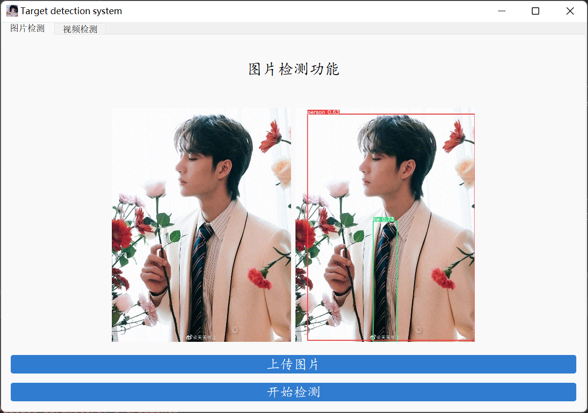

### 备份一个自用模板:sneezing_face:
**环境**  
python==3.8.5  
pip install -r requirements.txt  
(含数据集标注labelimg)  
**注意**  
1. `images` 文件夹需创建`tmp` 文件夹作为图片处理存放地  
2. 上传图片英文路径  

**演示**  
  
**调用摄像头**  
需要使用Iriun Webcam，像下图这样这样就可以~~自拍~~使用了  
 